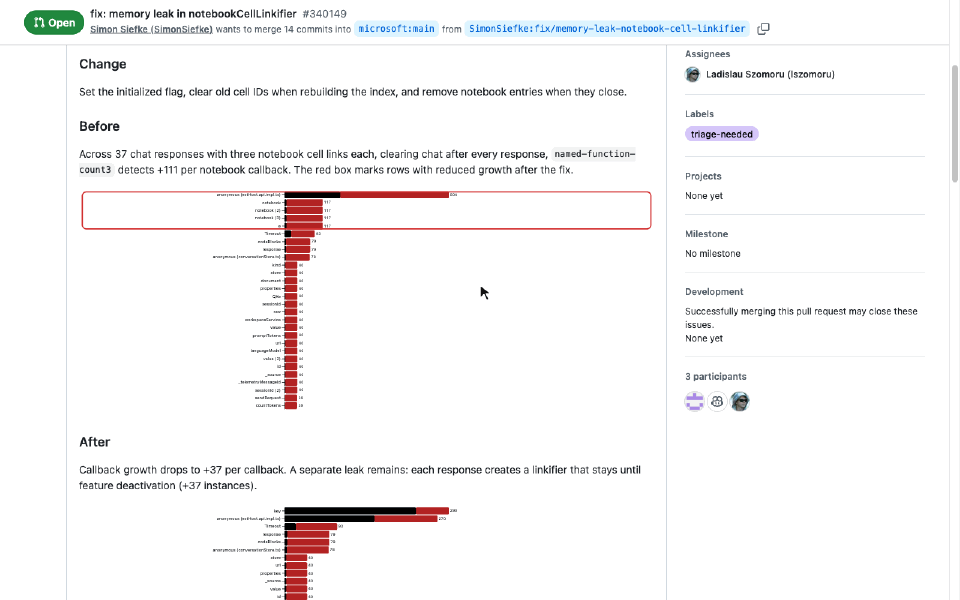
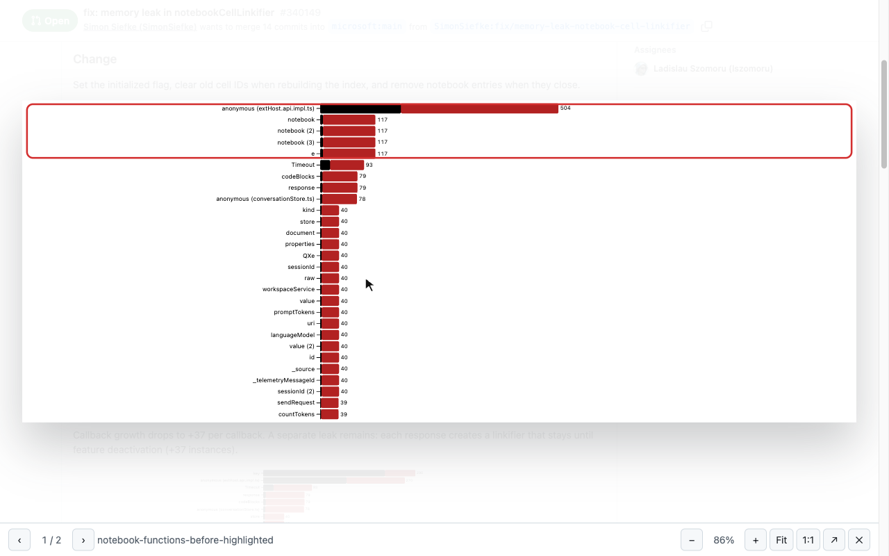
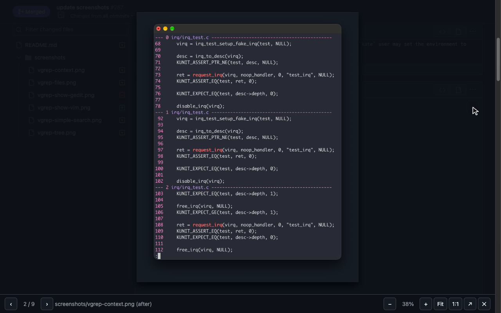

# Image Lightbox for GitHub PRs

Chrome extension (Manifest V3) that opens images in GitHub pull requests in an in-page lightbox instead of a new tab.

## Demo



*Clicking a comment screenshot, zooming, panning, stepping to the next image and closing it, then opening an image diff from **Files changed** and flipping between before and after.*

**Screenshot in a PR comment.** Clicking it opens the viewer on the page, with zoom, pan, ←/→ between images, and a toolbar that follows GitHub's light theme:



**Image diff in Files changed.** The ⤢ button on the diff opens the *before* and *after* images full size. Here it's showing *after* (2 / 9) in GitHub's dark theme:



### Try it yourself

With the extension installed, open these public PRs:

- [microsoft/vscode#340149](https://github.com/microsoft/vscode/pull/340149): click either chart screenshot in the description.
- [vrothberg/vgrep#267 → Files changed](https://github.com/vrothberg/vgrep/pull/267/files): click ⤢ on any `.png` diff, then press → to step through before/after for every changed screenshot.

## Build and install

```sh
npm install
npm test          # vitest + jsdom
npm run build     # → dist/
```

1. Open `chrome://extensions` and turn on **Developer mode**.
2. Click **Load unpacked** and select the `dist/` folder.
3. **Refresh any GitHub tabs that were already open.** Chrome only adds the extension to pages loaded after it was installed or reloaded. Until you refresh, clicks open a new tab as before.
4. After a rebuild, click the reload icon on the extension card, then refresh the tab.

## Publish

`npm run package` type-checks, tests, builds and writes `extension.zip`. Upload it in the [Chrome Web Store Developer Dashboard](https://chrome.google.com/webstore/devconsole). The listing copy, privacy answers and screenshots are in [`store/`](store/LISTING.md). For an update, bump `version` in `manifest.json` first.

## Usage

| Where | How |
|---|---|
| Description / comments / review threads | Click an image. Cmd/Ctrl/Shift/middle-click still open a new tab. |
| Files Changed image diffs | Click the ⤢ button in the top-right of the diff. The gallery shows *before* and *after*. |

| Key / gesture | Action |
|---|---|
| `Esc`, click backdrop, ✕ | Close |
| `←` / `→` | Previous / next image on the page (wraps) |
| `+` / `-`, mouse wheel / pinch | Zoom (wheel zooms at the cursor) |
| `0` / `1` | Fit to screen / original resolution |
| Drag | Pan |
| Double-click | Toggle fit ↔ 100% at the cursor |
| ↗ | Open original in a new tab |

## How it works

What GitHub does today (checked against live pages, Oct 2026):

- **Markdown images** (descriptions, comments) are rendered as `<a target="_blank" href=SRC></a>` inside `.markdown-body`, so clicking opens a new tab. External images use a `camo.githubusercontent.com` `src`, with the original URL in `data-canonical-src`.
- **Badge-style images** (`[](ci-url)`) link elsewhere. They are left alone.
- **Image diffs** in Files Changed are rendered in a cross-origin `viewscreen.githubusercontent.com` iframe that has its own 2-up/swipe/onion-skin viewer and no zoom. Clicks and even hovers inside it never reach the page. The iframe's `enc_url1`/`enc_url2`/`enc_url` query params hold the raw image URLs, hex-encoded.

The extension does three things:

- **One delegated `click` listener** on `document`, bubble phase. It acts only on a PR URL, on an unmodified left click, on an `` inside `.markdown-body` whose link points at the image itself. Everything else, including clicks GitHub already handled (`defaultPrevented`), passes through untouched. Comments loaded later and Turbo navigation work automatically.
- **Diff iframes** get an expand button. A 1ms CSS animation on `iframe[src^="https://viewscreen…"]` fires `animationstart` once per iframe as it renders, so there is no MutationObserver over GitHub's DOM. The image URLs are decoded from the iframe `src`. Nothing is injected into the iframe, so no extra host permission is needed.
- **Viewer**: a native `<dialog>` opened with `showModal()`, which provides the top layer, focus trap, `Esc` and focus restore. The gallery is collected from the page when the viewer opens. Colours come from GitHub's Primer CSS variables, so light, dark and high-contrast themes follow automatically.

**Permissions:** none. There is only a content script on `https://github.com/*`, which is needed because GitHub navigates between pages without a reload and won't re-inject a script that matches only `/pull/` URLs.

## Layout

```
manifest.json
src/images.ts    which images qualify, diff-URL decoding, gallery collection (pure)
src/viewer.ts    dialog, zoom/pan math, keyboard handling
src/content.ts   the click listener and the diff-button hook
src/content.css  viewer styles + diff-iframe detector
test/            fixtures based on real GitHub markup
```

## Known limits

- Verified on the classic Files Changed page (logged out). The newer React "changes" page may differ. If the expand buttons don't appear there, check the iframe `src` prefix in `src/images.ts`.
- Images inside rich diffs of other file types (e.g. rendered Markdown or SVG) are not included. Those use different renderers.
